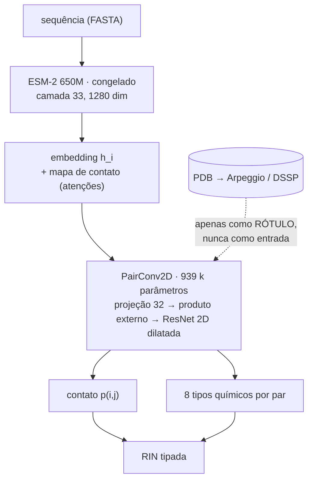
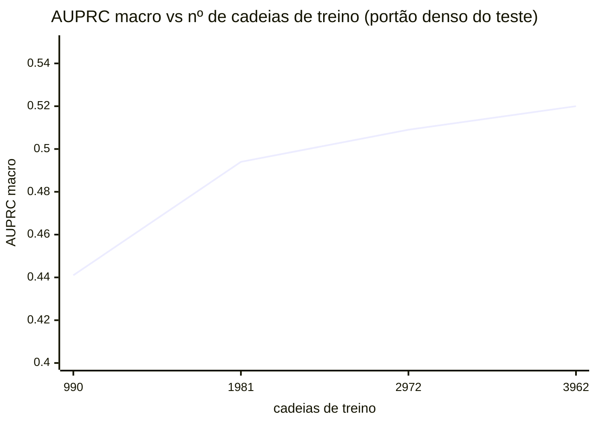

# SPIN-Seq

**S**equence-based **P**rediction of **I**nteraction **N**etworks: predição da **rede de interação
de resíduos (RIN)** de uma proteína a partir **apenas da sequência primária**.

Um *contact map* responde *"quais resíduos estão próximos?"*. O SPIN-Seq responde
**"como esses resíduos interagem?"**. Devolve um grafo de resíduos com arestas **tipadas**
(ligação de hidrogênio, hidrofóbica, iônica, π–π, van der Waals, ...), sem nunca ver a estrutura 3D.



---

## Por que isso importa

Saber que dois resíduos estão próximos **não diz** qual interação eles fazem. Isso é mensurável, e é
a tese do projeto: no conjunto de teste, cada aresta de contato carrega em média 1,06 tipos, e
**36,9% das arestas de contato não recebem nenhum** dos 8 tipos químicos. Somando as entropias
condicionais das 8 classes, há **3,21 bits por aresta que um mapa de contato não resolve**.

Em números: um mapa de contato **perfeito**, usado como preditor, atinge AUPRC macro **0,132**.
O SPIN-Seq, que só vê a sequência, atinge **0,520**, ou **3,9×** melhor. Nas classes puramente
químicas o contraste é mais duro ainda:

| Classe | Contato oráculo | SPIN-Seq |
|---|---|---|
| `ionic` | 0,014 | **0,394** |
| `aromatic` | 0,009 | **0,461** |
| `covalent` | 0,001 | **0,801** |

O oráculo de contato fica **indistinguível do acaso** nessas três. Proximidade espacial perfeita não
carrega identidade química; a sequência carrega.

---

## Resultados

Modelo campeão (`conv2d` + ESM-2 650M + ASL + features de par de AA), avaliado no **portão denso**
sobre 494 cadeias de teste, em todos os pares válidos e sem amostragem de negativos.

| Métrica | Valor | IC 95% (bootstrap, B=1000) |
|---|---|---|
| AUPRC contato | 0,815 | [0,801 – 0,829] |
| **AUPRC macro (8 tipos)** | **0,520** | **[0,506 – 0,535]** |

### AUPRC por classe

| Classe | AUPRC | |
|---|---:|---|
| `covalent` | 0,801 | `███████████████████▎    ` |
| `polar` | 0,796 | `███████████████████▏    ` |
| `vdw` | 0,681 | `████████████████▍       ` |
| `hydrophobic` | 0,599 | `██████████████▍         ` |
| `aromatic` | 0,461 | `███████████▏            ` |
| `ionic` | 0,394 | `█████████▌              ` |
| `carbonyl` | 0,359 | `████████▋               ` |
| `hbond` | 0,069 | `█▋                      ` |

Note `covalent`: **1.628** exemplos de treino e AUPRC **0,801**. E `hbond`: **18.876** exemplos,
11× mais, e AUPRC **0,069**. Volume de dados não é o gargalo dessa classe; ver
[Desafio aberto](#desafio-aberto-hbond).

### Curva de aprendizado: os dados ainda pagam



A curva **não saturou**. A inclinação por nat de `ln(n)` estabiliza em 0,076 → 0,037 → 0,038, ou
seja, não está decaindo. O ajuste é log-linear limpo:

```
macro = 0,0572 · ln(n) + 0,0509        R² = 0,967
```

O ganho de 75%→100% se concentra nas classes **raras** (`aromatic` +0,030, `covalent` +0,019,
`ionic` +0,017), contra +0,005 das densas. Extrapolando como ordem de grandeza, esgotar o pool de
dados já acessível (~10,9 k cadeias, sem relaxar nenhum filtro) levaria o macro a ≈ **0,570**.

> Os artefatos por trás de cada número estão versionados em `outputs/` (`gate_*.txt`,
> `bootstrap_champion.log`, `lc_conv2d_curve.csv`). Nada aqui é anotação: tudo é saída de execução.

---

## Instalação

O `pdbe-arpeggio` depende do OpenBabel, que costuma ser o ponto de atrito. Se você tiver conda,
prefira o caminho conda.

```bash
# opção A: conda (recomendada, resolve o OpenBabel)
conda env create -f environment.yml
conda activate spin-seq

# opção B: venv + pip
bash scripts/setup_env.sh
source .venv/bin/activate
```

O script de setup já verifica torch/CUDA e a importação do Arpeggio ao final.

**Nota de hardware.** Todo o projeto foi desenvolvido numa **GTX 1650 (4 GB)**. O ESM-2 roda em fp16
e o `PairConv2D` treina em *crops* 64×64, o que mantém o pico de VRAM em ~3,8 GB. A inferência é
*full-length* (matriz `L×L` inteira, sem reconstrução por crops).

⚠️ **O gargalo prático é a RAM do sistema, não a VRAM.** Carregar o ESM-2 650M do zero (que é o que
`predict.py --seq` faz) pede vários GB de RAM e é o passo que mais morre por OOM em máquinas de
8 GB. Feche o navegador antes. Comandos que leem embeddings do cache (`eval_dense.py`,
`bootstrap_ci.py`, `predict.py --pdb`) **não** carregam o ESM-2 e rodam folgados.

---

## Uso

### Inferência: de uma sequência a uma RIN

Este é o modo de uso real: nada de PDB, DSSP ou Arpeggio.

```bash
python src/predict.py --seq MQIFVKTLTGKTITLEVEPSDTIENVKAKIQDKEGIPPDQQRLIFAGKQLEDGRTLSDYNIQKESTLHLVLRLRGG
python src/predict.py --fasta minha.fasta --top 30
python src/predict.py --seq ... --csv saida.csv --npz saida.npz

# --pdb usa embedding e rótulos já em cache (modo de conferência, não de inferência)
python src/predict.py --pdb 2a6c_A --top 3
```

<details>
<summary><b>Exemplo de saída</b>: <code>2a6c_A</code>, uma cadeia do split de <b>teste</b> (o modelo nunca a viu)</summary>

```
>> L=76 pares válidos=2701 (i<j, |i-j|>=3)

== TOP-3 POR TIPO ==
hbond        11R-54F:0.62  42R-45D:0.59  45D-50K:0.58
polar        14L-18L:1.00  29Q-33A:1.00  28T-32A:1.00
ionic        42R-45D:0.76  31K-34E:0.63  11R-52D:0.63
aromatic     2H-5H:0.57   2H-6H:0.52    3H-6H:0.51
hydrophobic  29Q-43V:0.95  46L-54F:0.92  36L-62X:0.91
carbonyl     33A-38V:0.69  63I-66I:0.63  22L-25S:0.61
vdw          29Q-33A:0.99  14L-18L:0.99  28T-32A:0.99

>> CONFERÊNCIA contra rótulos: positivos reais=193 | precisão no Top-L=1.000
```

Repare que a **química sai correta sem nunca ver a estrutura**: os três primeiros `ionic` são
42**R**–45**D**, 31**K**–34**E** e 11**R**–52**D**, todas pontes salinas entre resíduos de carga oposta.
Os `aromatic` são todos His–His (empilhamento de anéis), e os `hydrophobic` são Leu/Phe/Val. É a
tese do projeto em uma saída: identidade química recuperada da sequência.

</details>

### Avaliação: o portão denso

```bash
python src/eval_dense.py --model conv2d \
    --config configs/esm650m_aa.yaml \
    --ckpt outputs/conv2d_650m_aa/best.pt
```

### Treino

```bash
python -u src/train_conv2d.py --config configs/esm650m_aa.yaml --out outputs/meu_run

# curva de aprendizado: fração do split de TREINO (val/test intactos)
python -u src/train_conv2d.py --config configs/esm650m_aa.yaml --frac 0.5 --out outputs/lc_50
```

### Análise estatística

```bash
# IC95 por bootstrap sobre as cadeias
python src/bootstrap_ci.py --ckpt outputs/conv2d_650m_aa/best.pt

# delta PAREADO entre dois checkpoints. Use isto para ablação, não dois ICs separados.
# --ckpt é o modelo A (referência); --ckpt-b liga o modo pareado e reporta o delta (B − A).
python src/bootstrap_ci.py \
    --ckpt   outputs/conv2d_650m_aa/best.pt \
    --ckpt-b outputs/conv2d_ssaux/best.pt
```

### Reconstruir o dataset

```bash
# sem --config ele usa configs/default.yaml (ESM-2 150M). Para a receita atual, passe a config.
python scripts/build_dataset.py --config configs/esm650m_aa.yaml --target 5000 --workers 4
```

> ⚠️ Leia [Reprodutibilidade](#reprodutibilidade-leia-antes-de-reconstruir-o-dataset) antes.

---

## Os dados

| | |
|---|---|
| Cadeias (após deduplicação) | **4.953** |
| Split treino / val / teste | 3.962 / 495 / 496 |
| Arestas positivas | 2.014.486 |
| Pares válidos no treino (`i<j`, `\|i−j\| ≥ 3`) | 40.088.397 |
| Densidade de arestas | **4,01%** |

**Seleção:** raio-X, resolução ≤ 2,5 Å, uma entidade proteica (monomérica → toda interação é
intra-cadeia), 30–350 resíduos, um único modelo depositado.

**Deduplicação anti-vazamento, a decisão metodológica mais importante.** Clusters do RCSB a
**30% de identidade**, **1 representante por cluster**, e o split é feito **por cluster, nunca por
cadeia**. Sem isso, homólogos quase idênticos cairiam dos dois lados e todos os números estariam
inflados.

**Supervisão:** `pdbe-arpeggio` sobre o mmCIF; OR dos tipos por par de resíduos; descarta água e
todo par com `|i−j| < 3`.

### As 8 classes

Do vocabulário bruto do Arpeggio (11 tipos), três saem: `proximal` (aparece em 99,995% das arestas,
é sinônimo de "há contato", sem conteúdo químico), `xbond` e `metal` (zero exemplos, inaprendíveis).

| Classe | Positivos (treino) | % das arestas | Desbalanço vs `polar` |
|---|---:|---:|---:|
| `polar` | 638.361 | 39,67% | 1,0× |
| `hydrophobic` | 469.958 | 29,21% | 1,4× |
| `vdw` | 467.439 | 29,05% | 1,4× |
| `carbonyl` | 57.910 | 3,60% | 11,0× |
| `ionic` | 22.280 | 1,38% | 28,7× |
| `hbond` | 18.876 | 1,17% | 33,8× |
| `aromatic` | 16.225 | 1,01% | 39,3× |
| `covalent` | 1.628 | 0,10% | **392,1×** |

O problema é duro porque **duas escalas se multiplicam**: só 4,01% dos pares são arestas, *e* dentro
das arestas a cauda é de 392×. Combinando, `covalent` é positivo em **4 de cada 100.000 pares**. É
por isso que a receita usa Asymmetric Loss e teto de peso de classe em 8.

### Formato no disco

`data/labels/` e `data/embeddings_650m/` casam **1:1 pelo nome** (`<pdb>_<chain>.npz`). É esse
casamento que garante o alinhamento resíduo-a-resíduo.

```
data/labels/<nome>.npz          27 MB no total (formato esparso)
    length    ()         L, comprimento da cadeia
    seq       ()         sequência
    types     (11,)      vocabulário bruto do Arpeggio
    idx_i     (E,)       ┐
    idx_j     (E,)       │ só as arestas POSITIVAS
    labels    (E,11)     ┘ multi-rótulo por aresta
    min_dist  (E,)       distância mínima do par

data/embeddings_650m/<nome>.npz         2,1 GB no total
    emb       (L,1280)   ESM-2 650M congelado, camada 33
    contacts  (L,L)      mapa de contato do ESM-2 (das atenções)
    seq       ()         sequência (conferência de alinhamento)
```

A matriz densa `L×L×T` **nunca** é materializada em disco, e é isso que faz 4.953 proteínas caberem
em 27 MB.

---

## Regra permanente: só-sequência

> **Toda ENTRADA do modelo tem de ser derivável da sequência.**
> Arpeggio e DSSP são **rótulos/alvos**, nunca entradas.

Entradas legítimas: embedding do ESM-2, mapa de contato do ESM-2, identidade de aminoácido,
`log1p|i−j|`.

Antes de adicionar qualquer feature, a pergunta é: *"isso existe para uma sequência sem estrutura?"*

No código a distinção é explícita e **não é cosmética**:

| flag | o que é | legítimo? |
|---|---|---|
| `use_ss` | estrutura secundária como **alvo** de uma cabeça auxiliar | ✅ sim |
| `ss_pair` | estrutura secundária como **canal de entrada** | ❌ não, exige estrutura 3D |

O treino emite aviso quando `ss_pair=True`. Essa separação existe porque uma versão inicial atingiu
macro 0,545 alimentando SS do DSSP como entrada, e a diferença de 0,020 para a versão limpa era
**exatamente** a informação privilegiada da estrutura 3D. A configuração vazada sobrevive apenas
como **ablação de teto** ("SS-oráculo"), nunca como campeão.

---

## Protocolo de avaliação

Todo número reportado vem do **portão denso**: avaliação sobre **todos** os pares válidos (`i<j`,
`|i−j| ≥ 3`) do teste, **sem amostragem de negativos**: 5.176.314 pares. É o protocolo mais severo
possível; amostrar negativos deixaria os números artificialmente altos.

A métrica principal é a **AUPRC macro** (média das 8 classes), robusta ao desbalanceamento: ao
contrário da acurácia, não premia acertar a classe negativa majoritária. Para referência, o macro de
um preditor aleatório é **0,005**.

Duas disciplinas que o projeto segue:

1. **Uma variável por vez**, medida no portão denso entre cada etapa, para atribuir cada ganho a uma
   causa.
2. **Para ablação, bootstrap PAREADO do delta**, nunca dois ICs separados. Intervalos sobrepostos
   **não** implicam ausência de diferença. Foi assim que um ganho aparente de +0,005 se revelou não
   significativo (p = 0,104).

---

## Desafio aberto: `hbond`

O `hbond` é o gargalo do macro (0,069) e entra no artigo como **desafio declarado**, não como falha
silenciosa. A hipótese natural era ruído de rótulo: a protonação via OpenBabel posiciona prótons de
forma quase arbitrária. Ela foi **testada e caiu**, por três evidências independentes:

1. **Piloto de protonação (119 estruturas).** Trocando o protocolo (`-mh` do Arpeggio), `hbond` é o
   único dos 9 tipos afetado, e os outros 8 batem Jaccard **1,000 exato**. Mesmo em `hbond` o Jaccard
   é 0,967 e o teto entre protocolos é **F1 0,983**, ordens de grandeza acima de 0,069.
2. **Diagnóstico condicional.** 96,3% das arestas `hbond` também são `polar`. Restringindo aos pares
   `polar`-positivos, a cabeça de `hbond` dá AUPRC **0,0928** contra acaso de **0,0242** (3,8×). Há
   sinal real e específico, mas pequeno. (`src/diag_hbond_polar.py`)
3. **Não responde a dados.** Na curva de aprendizado, `hbond` ganha **+0,001** no último quarto,
   contra +0,030 do `aromatic`. Quadruplicar o dado não move a agulha.

**Leitura:** dificuldade intrínseca. Decidir se um contato polar satisfaz a geometria angular do
hidrogênio exige detalhe sub-angstrom que a sequência não carrega nesta resolução.

---

## Reprodutibilidade (leia antes de reconstruir o dataset)

**`data/manifest.csv` é versionado de propósito.** Ele define qual cadeia caiu em treino, validação
ou teste. Sem ele, uma reconstrução gera um split **diferente** e nenhum número fica comparável com
os medidos aqui.

✅ **Split incremental estável (bug corrigido).** `write_manifest` sorteava o split de **todas** as
linhas a cada commit, via `permutation(len(rows))`. Com a contagem de linhas fixa isso era inócuo
(a permutação é determinística pelo seed), mas ao **expandir o dataset** a permutação mudava
inteira: medido no manifesto real, **uma única linha nova migrava 174 cadeias, 23 delas saindo do
teste para o treino** — cadeias já usadas para avaliar passariam a ser treinadas.

Agora as linhas com split atribuído ficam **congeladas** e só as novas são sorteadas, preenchendo o
split mais em falta para convergir às frações alvo. Verificado sobre `data/manifest.csv`: 300
adições incrementais, **zero** migrações, frações finais 0,800 / 0,100 / 0,100 e resultado
determinístico entre execuções. Para refazer o split do zero existe `reshuffle=True`, explícito
porque descarta todo o histórico experimental. (A deduplicação por cluster sempre esteve correta;
`representative_pdbs` já exclui clusters usados.)

**Cadeias de teste: 496 no manifesto, 494 avaliadas.** Em `5hbl_A` e `9qlx_A` o campo `length` do
rótulo está uma unidade maior que a sequência armazenada, e `eval_dense.py::load_chain` as descarta
por incompatibilidade. Defeito menor de contabilidade no construtor de rótulos; não afeta as
conclusões, mas o *n* correto a citar é **494**.

**Disco.** `data/arpeggio/` (24 GB de JSON) e `data/raw/` (3 GB de mmCIF) são **intermediários**: o
treino lê apenas `data/labels/` (27 MB) e `data/embeddings_650m/` (2,1 GB). Podando os
intermediários por lote, dobrar o dataset custa ~2,6 GB, não ~29 GB.

---

## Estrutura do repositório

```
configs/            YAMLs de experimento (esm650m_aa.yaml = receita campeã)
scripts/
  build_dataset.py    seleção RCSB + dedup por cluster + Arpeggio + rótulos
  build_embeddings.py cache do ESM-2
  build_labels.py     pós-processamento do Arpeggio
src/
  predict.py          INFERÊNCIA: sequência -> RIN (sem estrutura)
  train_conv2d.py     treino do PairConv2D (--frac p/ curva de aprendizado)
  eval_dense.py       o portão denso
  bootstrap_ci.py     IC95 e delta PAREADO entre dois checkpoints
  analyze_rin.py      quantificação da tese (RIN vs mapa de contato)
  diag_hbond_polar.py diagnóstico condicional do hbond
  losses.py           Asymmetric Loss + pesos de classe
  models/             PairConv2D, PairMLP
  data/               datasets (lazy) e leitura do manifesto
  supervision/        rótulos do Arpeggio, estrutura secundária
outputs/            evidência versionada (gate_*.txt, logs, curva); .pt ficam fora
data/               ignorado, exceto manifest.csv
```

---

## Estado atual

Modelo campeão treinado e medido; receita **ainda não congelada**. As frentes abertas, em ordem:

1. ~~Corrigir o `write_manifest`~~ ✅ feito — split incremental estável, expansão liberada.
2. Podar intermediários do Arpeggio por lote.
3. **Esgotar o pool de dados atual**: há 5.926 clusters novos disponíveis sem relaxar filtro nenhum
   (2,2× de dado, vazamento zero). É a frente com maior retorno esperado: ~+0,05 de macro, contra
   +0,005 do desempate arquitetural pendente.
4. Ensemble de 3 sementes na receita final → congelar → bootstrap definitivo.

Ablações já **refutadas** (não repetir): EMA dos pesos (delta 0,000) e `proj_dim` 32→128 (pior nas
8 classes; o modelo já sobreajusta, então o gargalo é **dado**, não capacidade).
