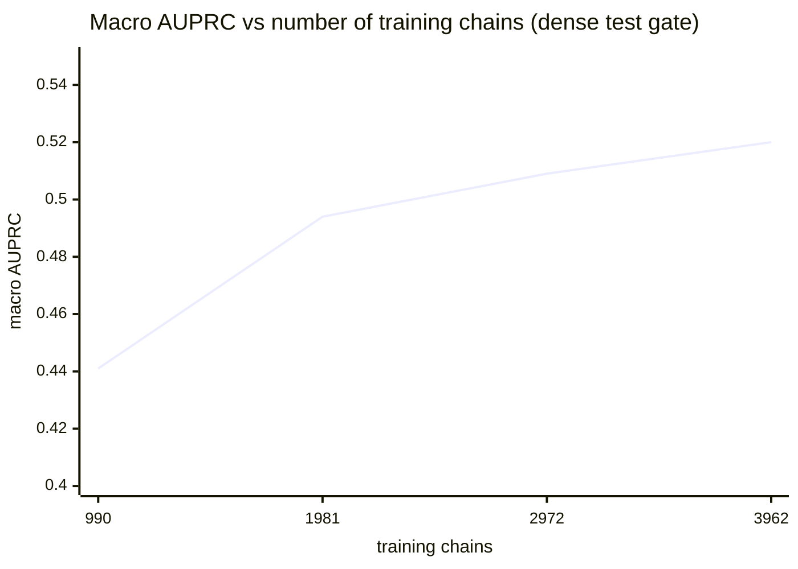

# SPIN-Seq

**S**equence-based **P**rediction of **I**nteraction **N**etworks: predicting the **residue
interaction network (RIN)** of a protein from **the primary sequence alone**.

A contact map answers *"which residues are close?"*. SPIN-Seq answers **"how do those residues
interact?"**. It returns a residue graph with **typed** edges (hydrogen bond, hydrophobic, ionic,
π–π, van der Waals, …) without ever seeing the 3D structure.


> 📄 **The manuscript is in this repository:** [`paper/spin-seq-bsb2026.pdf`](paper/spin-seq-bsb2026.pdf)
> (6 pages), with its LaTeX source alongside it. **Reviewing it?** Start at
> **[REVIEWERS.md](REVIEWERS.md)** — it maps every number in the paper to the file here that
> produced it.

---

## Why this matters

Knowing that two residues are close **does not tell you** which interaction they form. That is
measurable, and it is the thesis of the project: on the test set each contact edge carries **1.06
types on average**, and **36.9% of contact edges receive none** of the 8 chemical types. Summing the
conditional entropies of the 8 classes, there are **3.21 bits per edge that a contact map does not
resolve**.

In numbers: a **perfect** contact map, used as a predictor, reaches macro AUPRC **0.132**. SPIN-Seq,
which only sees the sequence, reaches **0.520**, or **3.9×** better. In the purely chemical classes
the contrast is starker still:

| Class | Contact oracle | SPIN-Seq |
|---|---|---|
| `ionic` | 0.014 | **0.394** |
| `aromatic` | 0.009 | **0.461** |
| `covalent` | 0.001 | **0.801** |

The contact oracle is **indistinguishable from chance** in those three. Perfect spatial proximity
carries no chemical identity; the sequence does.

---

## Results

Champion model (`conv2d` + ESM-2 650M + ASL + AA-pair features), evaluated under the **dense gate**
over 494 test chains, on every valid pair and with no negative sampling.

| Metric | Value | 95% CI (bootstrap, B = 1000) |
|---|---|---|
| Contact AUPRC | 0.815 | [0.801 – 0.829] |
| **Macro AUPRC (8 types)** | **0.520** | **[0.506 – 0.535]** |

### Per-class AUPRC

| Class | AUPRC | |
|---|---:|---|
| `covalent` | 0.801 | `███████████████████▎    ` |
| `polar` | 0.796 | `███████████████████▏    ` |
| `vdw` | 0.681 | `████████████████▍       ` |
| `hydrophobic` | 0.599 | `██████████████▍         ` |
| `aromatic` | 0.461 | `███████████▏            ` |
| `ionic` | 0.394 | `█████████▌              ` |
| `carbonyl` | 0.359 | `████████▋               ` |
| `hbond` | 0.069 | `█▋                      ` |

Note `covalent`: **1,628** training examples and AUPRC **0.801**. And `hbond`: **18,876** examples,
11× more, and AUPRC **0.069**. Data volume is not the bottleneck for that class; see
[Open challenge](#open-challenge-hbond).

### Learning curve: data still pays



The curve has **not saturated**. The slope per nat of `ln(n)` settles at 0.076 → 0.037 → 0.038, that
is, it is not decaying. The fit is cleanly log-linear:

```
macro = 0.0572 · ln(n) + 0.0509        R² = 0.967
```

The 75%→100% gain concentrates in the **rare** classes (`aromatic` +0.030, `covalent` +0.019,
`ionic` +0.017), against +0.005 for the dense ones. Extrapolating as an order of magnitude,
exhausting the data pool already accessible (~10.9k chains, without relaxing any filter) would take
the macro to ≈ **0.570**.

> The artefacts behind every number are versioned under `outputs/` (`gate_*.txt`,
> `bootstrap_champion.log`, learning-curve gates). Nothing here is a note written afterwards:
> everything is run output.
>
> ⚠️ **`outputs/` is in Portuguese and stays that way on purpose.** Those files are raw `stdout`
> from the runs. Translating them would make them edited text rather than evidence, so they are
> left byte-for-byte as produced. [REVIEWERS.md](REVIEWERS.md) explains what to read in each one.

---

## Installation

`pdbe-arpeggio` depends on OpenBabel, which is usually the friction point. If you have conda, prefer
the conda path.

```bash
# option A: conda (recommended, resolves OpenBabel)
conda env create -f environment.yml
conda activate spin-seq

# option B: venv + pip
bash scripts/setup_env.sh
source .venv/bin/activate
```

The setup script checks torch/CUDA and the Arpeggio import at the end.

**Hardware note.** The whole project was developed on a **GTX 1650 (4 GB)**. ESM-2 runs in fp16 and
`PairConv2D` trains on 64×64 *crops*, which keeps peak VRAM at ~3.8 GB. Inference is *full-length*
(the entire `L×L` matrix, with no crop-based reconstruction).

⚠️ **The practical bottleneck is system RAM, not VRAM.** Loading ESM-2 650M from scratch (which is
what `predict.py --seq` does) needs several GB of RAM and is the step most likely to die of OOM on
8 GB machines. Close the browser first. Commands that read embeddings from cache
(`eval_dense.py`, `bootstrap_ci.py`, `predict.py --pdb`) do **not** load ESM-2 and run comfortably.

---

## Usage

### Inference: from a sequence to a RIN

This is the real usage mode: no PDB, no DSSP, no Arpeggio.

```bash
python src/predict.py --seq MQIFVKTLTGKTITLEVEPSDTIENVKAKIQDKEGIPPDQQRLIFAGKQLEDGRTLSDYNIQKESTLHLVLRLRGG
python src/predict.py --fasta mine.fasta --top 30
python src/predict.py --seq ... --csv out.csv --npz out.npz

# --pdb uses cached embeddings and labels (verification mode, not inference)
python src/predict.py --pdb 2a6c_A --top 3
```

<details>
<summary><b>Sample output</b>: <code>2a6c_A</code>, a chain from the <b>test</b> split (the model never saw it)</summary>

```
>> L=76 pares válidos=2701 (i<j, |i-j|>=3)

== TOP-3 POR TIPO ==
hbond        11R-54F:0.62  42R-45D:0.59  45D-50K:0.58
polar        14L-18L:1.00  29Q-33A:1.00  28T-32A:1.00
ionic        42R-45D:0.76  31K-34E:0.63  11R-52D:0.63
aromatic     2H-5H:0.57   2H-6H:0.52    3H-6H:0.51
hydrophobic  29Q-43V:0.95  46L-54F:0.92  36L-62X:0.91
carbonyl     33A-38V:0.69  63I-66I:0.63  22L-25S:0.61
vdw          29Q-33A:0.99  14L-18L:0.99  28T-32A:0.99

>> CONFERÊNCIA contra rótulos: positivos reais=193 | precisão no Top-L=1.000
```

*(The program's own output is in Portuguese: `pares válidos` = valid pairs, `TOP-3 POR TIPO` =
top 3 per type, `CONFERÊNCIA contra rótulos` = check against labels, `positivos reais` = true
positives, `precisão` = precision.)*

Note that **the chemistry comes out right without ever seeing the structure**: the top three `ionic`
are 42**R**–45**D**, 31**K**–34**E** and 11**R**–52**D**, all salt bridges between oppositely charged
residues. The `aromatic` ones are all His–His (ring stacking), and the `hydrophobic` ones are
Leu/Phe/Val. It is the thesis of the project in a single output: chemical identity recovered from
the sequence.

</details>

### Evaluation: the dense gate

```bash
python src/eval_dense.py --model conv2d \
    --config configs/esm650m_aa.yaml \
    --ckpt outputs/conv2d_650m_aa/best.pt
```

### Training

```bash
python -u src/train_conv2d.py --config configs/esm650m_aa.yaml --out outputs/my_run

# learning curve: a fraction of the TRAINING split (val/test untouched)
python -u src/train_conv2d.py --config configs/esm650m_aa.yaml --frac 0.5 --out outputs/lc_50
```

### Statistical analysis

```bash
# 95% CI by bootstrap over chains
python src/bootstrap_ci.py --ckpt outputs/conv2d_650m_aa/best.pt

# PAIRED delta between two checkpoints. Use this for ablation, not two separate CIs.
# --ckpt is model A (reference); --ckpt-b turns on paired mode and reports the delta (B − A).
python src/bootstrap_ci.py \
    --ckpt   outputs/conv2d_650m_aa/best.pt \
    --ckpt-b outputs/conv2d_ssaux/best.pt
```

### Rebuilding the dataset

```bash
# without --config it uses configs/default.yaml (ESM-2 150M). For the current recipe, pass the config.
python scripts/build_dataset.py --config configs/esm650m_aa.yaml --target 5000 --workers 4
```

> ⚠️ Read [Reproducibility](#reproducibility-read-before-rebuilding-the-dataset) first.

---

## The data

| | |
|---|---|
| Chains (after deduplication) | **4,953** |
| Train / val / test split | 3,962 / 495 / 496 |
| Positive edges | 2,014,486 |
| Valid training pairs (`i<j`, `\|i−j\| ≥ 3`) | 40,088,397 |
| Edge density | **4.01%** |

**Selection:** X-ray, resolution ≤ 2.5 Å, one protein entity (monomeric → every interaction is
intra-chain), 30–350 residues, a single deposited model.

**Anti-leakage deduplication, the most important methodological decision.** RCSB clusters at **30%
identity**, **1 representative per cluster**, and the split is made **by cluster, never by chain**.
Without this, near-identical homologues would fall on both sides and every number would be inflated.

**Supervision:** `pdbe-arpeggio` over the mmCIF; types OR-ed per residue pair; water and every pair
with `|i−j| < 3` discarded.

### The 8 classes

Of Arpeggio's raw vocabulary (11 types), three are dropped: `proximal` (present on 99.995% of edges,
a synonym for "there is a contact", with no chemical content), `xbond` and `metal` (zero examples,
unlearnable).

| Class | Positives (train) | % of edges | Imbalance vs `polar` |
|---|---:|---:|---:|
| `polar` | 638,361 | 39.67% | 1.0× |
| `hydrophobic` | 469,958 | 29.21% | 1.4× |
| `vdw` | 467,439 | 29.05% | 1.4× |
| `carbonyl` | 57,910 | 3.60% | 11.0× |
| `ionic` | 22,280 | 1.38% | 28.7× |
| `hbond` | 18,876 | 1.17% | 33.8× |
| `aromatic` | 16,225 | 1.01% | 39.3× |
| `covalent` | 1,628 | 0.10% | **392.1×** |

The problem is hard because **two scales multiply**: only 4.01% of pairs are edges, *and* within the
edges the tail spans 392×. Combined, `covalent` is positive in **4 out of every 100,000 pairs**.
That is why the recipe uses Asymmetric Loss and a class-weight cap of 8.

### On-disk format

`data/labels/` and `data/embeddings_650m/` match **1:1 by name** (`<pdb>_<chain>.npz`). That
matching is what guarantees residue-by-residue alignment.

```
data/labels/<name>.npz          27 MB in total (sparse format)
    length    ()         L, chain length
    seq       ()         sequence
    types     (11,)      Arpeggio's raw vocabulary
    idx_i     (E,)       ┐
    idx_j     (E,)       │ POSITIVE edges only
    labels    (E,11)     ┘ multi-label per edge
    min_dist  (E,)       minimum distance of the pair

data/embeddings_650m/<name>.npz         2.1 GB in total
    emb       (L,1280)   ESM-2 650M frozen, layer 33
    contacts  (L,L)      ESM-2 contact map (from the attentions)
    seq       ()         sequence (alignment check)
```

The dense `L×L×T` matrix is **never** materialised on disk, and that is what makes 4,953 proteins
fit in 27 MB.

---

## Permanent rule: sequence-only

> **Every model INPUT must be derivable from the sequence.**
> Arpeggio and DSSP are **labels/targets**, never inputs.

Legitimate inputs: the ESM-2 embedding, the ESM-2 contact map, amino-acid identity, `log1p|i−j|`.

Before adding any feature, the question is: *"does this exist for a sequence with no structure?"*

In the code the distinction is explicit and **not cosmetic**:

| flag | what it is | legitimate? |
|---|---|---|
| `use_ss` | secondary structure as the **target** of an auxiliary head | ✅ yes |
| `ss_pair` | secondary structure as an **input channel** | ❌ no, requires 3D structure |

Training emits a warning when `ss_pair=True`. This separation exists because an early version
reached macro 0.545 by feeding DSSP secondary structure as an input, and the 0.020 difference from
the clean version was **exactly** the privileged information from the 3D structure. The leaking
configuration survives only as a **ceiling ablation** ("SS-oracle"), never as the champion.

---

## Evaluation protocol

Every number reported comes from the **dense gate**: evaluation over **all** valid test pairs
(`i<j`, `|i−j| ≥ 3`), **with no negative sampling**: 5,176,314 pairs. It is the most severe protocol
possible; sampling negatives would leave the numbers artificially high.

The main metric is **macro AUPRC** (the mean over the 8 classes), robust to imbalance: unlike
accuracy, it does not reward getting the majority negative class right. For reference, the macro of
a random predictor is **0.005**.

Two disciplines the project follows:

1. **One variable at a time**, measured at the dense gate between each step, so that every gain can
   be attributed to a cause.
2. **For ablation, a PAIRED bootstrap of the delta**, never two separate CIs. Overlapping intervals
   do **not** imply the absence of a difference. That is how an apparent +0.005 gain turned out not
   to be significant (p = 0.104).

---

## Open challenge: `hbond`

`hbond` is the bottleneck of the macro (0.069) and enters the paper as a **declared challenge**, not
as a silent failure. The natural hypothesis was label noise: protonation via OpenBabel places
protons almost arbitrarily. It was **tested and rejected**, on three independent pieces of evidence:

1. **Protonation pilot (119 structures).** Switching the protocol (Arpeggio's `-mh`), `hbond` is the
   only one of the 9 types affected, and the other 8 match at Jaccard **1.000 exactly**. Even for
   `hbond` the Jaccard is 0.967 and the ceiling between protocols is **F1 0.983**, orders of
   magnitude above 0.069.
2. **Conditional diagnosis.** 96.3% of `hbond` edges are also `polar`. Restricting to
   `polar`-positive pairs, the `hbond` head gives AUPRC **0.0928** against a chance floor of
   **0.0242** (3.8×). There is real, specific signal, but it is small. (`src/diag_hbond_polar.py`)
3. **It does not respond to data.** On the learning curve, `hbond` gains **+0.001** in the last
   quarter, against +0.030 for `aromatic`. Quadrupling the data does not move the needle.

**Reading:** intrinsic difficulty. Deciding whether a polar contact satisfies the angular geometry
of the hydrogen requires sub-angstrom detail that the sequence does not carry at this resolution.

---

## Reproducibility (read before rebuilding the dataset)

**`data/manifest.csv` is versioned on purpose.** It defines which chain fell into train, validation
or test. Without it, a rebuild generates a **different** split and no number is comparable with the
ones measured here.

`data/splits/{train,val,test}.txt` hold the same lists in plain text (3,962 / 495 / 496 chains),
for checking without opening the CSV.

✅ **Stable incremental split (bug fixed).** `write_manifest` used to draw the split for **all** rows
on every commit, via `permutation(len(rows))`. With a fixed row count that was harmless (the
permutation is deterministic given the seed), but when **expanding the dataset** the whole
permutation changed: measured on the real manifest, **a single new row migrated 174 chains, 23 of
them moving from test into train** — chains already used for evaluation would start being trained on.

Now rows with an assigned split are **frozen** and only new ones are drawn, filling the split that
is furthest behind so as to converge to the target fractions. Verified over `data/manifest.csv`:
300 incremental additions, **zero** migrations, final fractions 0.800 / 0.100 / 0.100 and a
deterministic result across runs. To redo the split from scratch there is `reshuffle=True`, made
explicit because it discards the entire experimental history. (Cluster deduplication was always
correct; `representative_pdbs` already excludes used clusters.)

**Test chains: 496 in the manifest, 494 evaluated.** In `5hbl_A` and `9qlx_A` the label's `length`
field is one unit larger than the stored sequence, and `eval_dense.py::load_chain` discards them for
the mismatch. A minor bookkeeping defect in the label builder; it does not affect the conclusions,
but the correct *n* to quote is **494**.

**Disk.** `data/arpeggio/` (24 GB of JSON) and `data/raw/` (3 GB of mmCIF) are **intermediates**:
training reads only `data/labels/` (27 MB) and `data/embeddings_650m/` (2.1 GB). Pruning the
intermediates batch by batch, doubling the dataset costs ~2.6 GB, not ~29 GB.

---

## Repository layout

```
paper/              📄 the manuscript (PDF) and its LaTeX source
REVIEWERS.md        📄 every number in the manuscript mapped to its source file
figures/            pipeline figure (TikZ source + PNG)
configs/            experiment YAMLs (esm650m_aa.yaml = champion recipe)
scripts/
  build_dataset.py    RCSB selection + cluster dedup + Arpeggio + labels
  build_embeddings.py ESM-2 cache
  build_labels.py     Arpeggio post-processing
  run_gates.sh        reproduces the whole ablation ladder on the test split
  run_seeds.sh        repeats the final recipe on three seeds
  run_boots.sh        paired bootstraps
src/
  predict.py          INFERENCE: sequence -> RIN (no structure)
  train_conv2d.py     PairConv2D training (--frac for the learning curve)
  eval_dense.py       the dense gate
  bootstrap_ci.py     95% CI and PAIRED delta between two checkpoints
  analyze_rin.py      quantification of the thesis (RIN vs contact map)
  diag_hbond_polar.py conditional diagnosis of hbond
  losses.py           Asymmetric Loss + class weights
  models/             PairConv2D, PairMLP
  data/               datasets (lazy) and manifest reading
  supervision/        Arpeggio labels, secondary structure
outputs/            versioned evidence (gate_*.txt, logs, curve); .pt files stay out
data/               ignored, except manifest.csv and splits/
```

---

## Current status

Champion model trained and measured; the recipe is **not yet frozen**. Open fronts, in order:

1. ~~Fix `write_manifest`~~ ✅ done — stable incremental split, expansion unblocked.
2. Prune Arpeggio intermediates batch by batch.
3. **Exhaust the current data pool**: 5,926 new clusters are available without relaxing any filter
   (2.2× the data, zero leakage). This is the front with the highest expected return: ~+0.05 macro,
   against +0.005 for the pending architectural tie-break.
4. Ensemble of 3 seeds on the final recipe → freeze → definitive bootstrap.

Ablations already **refuted** (do not repeat): weight EMA (delta 0.000) and `proj_dim` 32→128 (worse
on all 8 classes; the model already overfits, so the bottleneck is **data**, not capacity).

---

## Publication status

⚠️ **The manuscript in [`paper/`](paper/) is a preprint under submission. It has not been
peer-reviewed, accepted or published.** It is included here so that the reported numbers can be
checked against the code and the raw evaluation outputs that produced them.

A citation entry will be added here **only if and when the paper is accepted**. Until then, please
refer to this repository directly and describe the work as unpublished.

## License

MIT — see [LICENSE](LICENSE).
