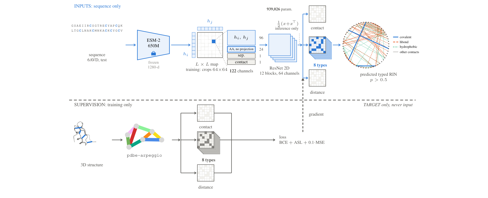

# For reviewers — where every number in the paper comes from

This file maps each claim in **“SPIN-Seq: predicting the typed residue interaction network from
sequence”** (BSB 2026, short paper) to the file in this repository that produced it.

Nothing here is a summary written after the fact: `outputs/` holds the **raw stdout** of the runs.
Model weights (`.pt`, ~265 MB) are not versioned; every number that does not require them is.

> **Language note.** Documentation, code comments and configs are in English. **`outputs/` is
> not, and stays that way on purpose:** those files are raw `stdout` from the runs. Translating
> them would turn evidence into edited text, so they are left byte-for-byte as produced. The
> headings you will meet there: `AVALIAÇÃO DENSA` = dense evaluation, `todos os pares válidos` =
> all valid pairs, `cadeias` = chains, `classe` = class, `faixa de separação` = separation range,
> `acaso` = chance, `prevalência` = prevalence, `tipos por aresta de contato` = types per contact
> edge, `bits que o contact map NÃO resolve por aresta` = bits the contact map does NOT resolve
> per edge.



*Above the barrier, the input path, entirely derivable from the sequence. Below it, the
supervision. `pdbe-arpeggio` reads the 3D structure, but its labels reach the model only through
the training loss; at inference the lower half is absent. Source: `figures/fig1_pipeline.tex`
(TikZ, as published in the paper).*

---

## 0. The two-minute check

```bash
# the headline: macro AUPRC 0.520 against a perfect contact map at 0.132
grep AUPRC_types_macro outputs/gate_passo3.txt        # 0.520  — SPIN-Seq, final recipe
grep AUPRC_types_macro outputs/gate_propensity.txt    # 0.110  — amino-acid propensity baseline
grep -A12 'B) RANKERS' outputs/analyze_rin_champion.log   # per-class table, incl. oracle 0.132

# the anti-leakage protocol: 4,953 chains, no overlap between splits
wc -l data/splits/*.txt                                # 3962 / 495 / 496
sort data/splits/train.txt data/splits/test.txt | uniq -d | wc -l   # 0
```

---

## 1. ⚠️ Two traps to know before reading the logs

**`run_seeds.log` reports validation, not test.** Lines such as
`melhor AUPRC_types_macro=0.540` are the **validation** macro used to pick the checkpoint during
training. They are **not** comparable to the paper. The test numbers are the `gate_*.txt` files.
Reading 0.540 as a test result would be wrong by +0.02.

**`gate_ssaux*` and `gate_ss_oraculo` are ceiling ablations, not results.** They feed
**secondary structure** as an *input*, which violates the sequence-only rule the paper is built on
(`gate_ssaux` = 0.525, `gate_ss_oraculo` = 0.545). They are kept for transparency. **Neither is
reported in the paper, and neither should be cited as a SPIN-Seq result.**

---

## 2. Abstract and Results — the headline numbers

| Claim in the paper | Value | Source |
|---|---|---|
| macro AUPRC, final recipe, reference seed | **0.520** | `outputs/gate_passo3.txt` |
| 95% CI of the macro | **[0.506, 0.535]** | `outputs/boot_ssaux_s42.txt` |
| perfect contact map used as oracle | **0.132** | `outputs/analyze_rin_champion.log` §B |
| amino-acid propensity baseline | **0.110** | `outputs/gate_propensity.txt` |
| model’s own contact head (`p-contact`) | **0.174** | `outputs/analyze_rin_champion.log` §B |
| test pairs evaluated | **5,176,314** | `outputs/analyze_rin_champion.log` §A |
| contacts among them | **206,700 (3.99%)** | same |
| chains evaluated | **494** | header line of any `gate_*.txt` |
| mean types per contact edge | **1.06** | `outputs/analyze_rin_champion.log` §A |
| contact edges with none of the 8 types | **36.9%** | same |
| entropy a perfect contact map leaves unresolved | **3.209 bits** (`SOMA`) | same |
| lower bound of that entropy (`polar`) | **0.97 bit** | same, `H(polar\|contato)` = 0.9714 |

**Per-class table (Table 1 of the paper)** — `outputs/analyze_rin_champion.log`, section B, gives
`prevalence / oracle / p_contact / RIN` for all eight classes plus the macro row.

> **Known limitation of this log.** The `prevalence` column is printed to **three decimals**, so the
> rare classes read `0.000`. That is why Table 1 in the paper shows **training-set** prevalence
> (labelled `Train prev.`) rather than test prevalence: the exact per-class **test** positive counts
> are not emitted anywhere in this repository, except for `polar` (82,837) and `hbond` (2,063) in
> `outputs/diag_hbond_polar.txt`.
> **Deriving them from the oracle column would be circular** — the oracle *is*
> prevalence ÷ contact density — so the paper does not do it. Emitting the raw counts is the one
> improvement that would let Table 1 demonstrate the oracle identity on its own.

---

## 3. The ablation ladder (Table 2 of the paper)

Every row was scored on the **same test split**. The paper states this: the ladder is descriptive,
and the final value is **selected on the test set**.

| Step | Change | Contact | Macro | Source |
|---:|---|---:|---:|---|
| 0 | Pair MLP | 0.718 | 0.429 | `outputs/gate_baseline650m.txt` |
| 1 | $L\times L$ map + ResNet | 0.814 | 0.440 | `outputs/gate_conv2d_650m.txt` |
| 2 | class-weight cap 3→8 | 0.815 | 0.460 | `outputs/gate_cap8.txt` |
| 3 | ASL instead of focal loss | 0.815 | 0.478 | `outputs/gate_asl.txt` |
| 4 | **AA-pair feature (final)** | **0.815** | **0.520** | `outputs/gate_passo3.txt` |

Reproduce the whole ladder: `bash scripts/run_gates.sh`.

**Width ablation** — widening the projection to 128 gives contact/macro **0.801 / 0.500**, with no
class improving: `outputs/gate_proj128.txt`.

**Three seeds of the final recipe** — the paper reports **0.518 ± 0.003**:

| Seed | Macro (test) | Source |
|---|---:|---|
| 42 (reference) | 0.520 | `outputs/gate_passo3.txt` |
| 43 | 0.515 | `outputs/gate_passo3_s43.txt` |
| 44 | 0.518 | `outputs/gate_passo3_s44.txt` |

Mean 0.5177 → **0.518**; standard deviation 0.0025 → **0.003**. This is the spread across seeds, a
different quantity from the bootstrap CI. Differences below ≈0.01 are treated as unresolved
throughout the paper.

**Learning curve** — nested fractions of the *training* split, validation and test untouched:

| Fraction | Macro | Source |
|---|---:|---|
| 25% | 0.441 | `outputs/gate_lc_0.25.txt` |
| 50% | 0.494 | `outputs/gate_lc_0.50.txt` |
| 75% | 0.509 | `outputs/gate_lc_0.75.txt` |
| 100% | 0.520 | `outputs/gate_passo3.txt` |

---

## 4. Discussion — the `hbond` challenge

| Claim | Source |
|---|---|
| `hbond` AUPRC 0.069, the weakest class | `outputs/analyze_rin_champion.log` §B |
| mean of the other seven = 0.584 | computed from the same table |
| re-deriving labels with Arpeggio’s hydrogen-minimisation protocol over 119 structures changes `hbond` only modestly (Jaccard 0.967; exactly 1.000 for the other eight non-empty types) | `outputs/pilot_mh.log` |
| `hbond` has 11.6× more training examples than `covalent` yet ~1/11 of its AUPRC | training counts in `README.md` §Os dados; AUPRC in §B above |
| conditional diagnosis of `hbond` inside `polar` | `outputs/diag_hbond_polar.txt` |

---

## 5. Statistics

| Claim | Source |
|---|---|
| 95% CIs from bootstrapping **chains**, not pairs (B = 1000) | `src/bootstrap_ci.py`; `outputs/boot_*.txt` |
| paired bootstrap against the propensity baseline, all nine comparisons significant at p = 1/B = 0.001 | `outputs/boot_pareado_propensity.txt`, `_v2.txt` |
| exact step-wise average precision over the score histogram, checked against `scikit-learn`; ties share a rank | `src/metrics.py` |
| Top-$L$ separation ranges (`short` 6–12, `medium` 12–24, `long` ≥24) | `src/metrics.py`, `RANGES` |

Bootstrap over **chains** rather than pairs is deliberate: the 5,176,314 pairs are not independent
observations, and resampling them would produce intervals that are far too narrow.

---

## 6. Data and the anti-leakage protocol

| Claim | Source |
|---|---|
| one representative per 30%-identity cluster | `scripts/build_dataset.py` |
| split 3,962 / 495 / 496 chains | `data/splits/*.txt`, derived from `data/manifest.csv` |
| 494 of the 496 test chains evaluated (two dropped for a label-length mismatch) | header of any `gate_*.txt` |
| intra-chain scope enforced at labelling time | `src/supervision/arpeggio_labels.py` — both atoms must share `auth_asym_id`, plus the `INTRA_SELECTION` filter |
| labels from `pdbe-arpeggio`, types OR-ed per pair, water and `\|i−j\| < 3` discarded | same file |
| 4.01% of the 40,088,397 valid training pairs are edges; classes span a 392-fold range | `README.md` §Os dados |

`data/manifest.csv` is the artefact that makes the numbers comparable. Rebuilding the dataset
without it produces a **different** cluster assignment, and no result can then be compared with the
published ones.

---

## 7. What this repository does **not** contain

Stated plainly, because a reviewer will look for these:

- **Model weights** (`.pt`, ~265 MB) — excluded by size. Every number that does not need them is here.
- **Raw PDB/mmCIF files and the embedding cache** — rebuildable from `scripts/build_dataset.py` and
  `scripts/build_embeddings.py`.
- **Exact per-class test positive counts** — see the box in §2.
- **A held-out test split never used during development.** The recipe was selected on the same
  evaluation the paper reports. This is disclosed in the paper (abstract, §2.3, Table 2 caption and
  conclusion) and is the main limitation of the result.
- **The fold-and-profile comparison** — the route the introduction argues against was not run.
- **Δ ± CI95 per rung of the ablation ladder** — this needs the per-step checkpoints, which are not
  versioned.

---

## 8. Reproducing from scratch

```bash
conda env create -f environment.yml && conda activate spinseq   # resolves OpenBabel
python scripts/build_dataset.py --config configs/esm650m_aa.yaml
python scripts/build_embeddings.py --config configs/esm650m_aa.yaml
bash scripts/run_gates.sh          # the full ablation ladder on the test split
bash scripts/run_boots.sh          # bootstrap CIs and paired deltas
```

See `README.md` §Reprodutibilidade for the caveats — in particular, **reuse `data/manifest.csv`**
rather than regenerating the split.

Training runs on a single **GTX 1650 (4 GB)**; the head has 939,026 trainable parameters, under
0.15% of the frozen ESM-2 650M encoder.
